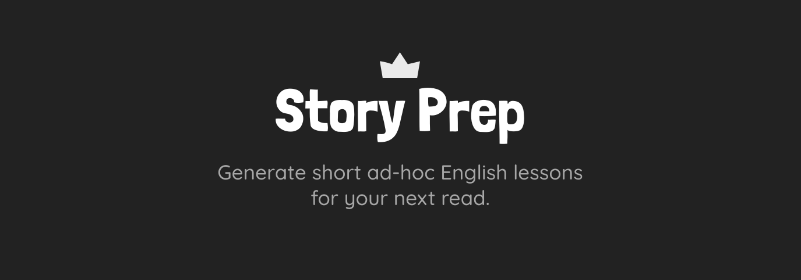

[](LICENSE)
[](https://clarifai.com/openai/tts/models/openai-tts-1)
[](https://clarifai.com/openai/tts/models/openai-gpt-4-turbo)

[](LICENSE)

## Intro

What if you could learn another language by reading your favorite authors? And I don't talk about just reading them with a dictionary at hand. I mean lessons that teach just the necessary for you to enjoy that particular story 🗝🚪.

Just go to [storyprep.vercel.app](https://storyprep.vercel.app)

Or install the Clarifai [module](https://clarifai.com/luvejo/english-lesson-generator/modules/story_prep) (just make sure you [set](https://docs.clarifai.com/portal-guide/modules/secrets-management/) the `CLARIFAI_PAT` env var).

## Features

- Generate custom vocabulary sheet based on any story you provide.
- Generate a companion audio lesson.
- Download lesson as PDF.
- Download lesson as audio.

## Setup

Make sure to install the dependencies:

```bash
npm install # or  yarn install
```

## Development Server

Start the development server on `http://localhost:3000`:

```bash
npm run dev # or yarn dev
```

## Production

Build the application for production:

```bash
npm run build # or yarn build
```

Locally preview production build:

```bash
npm run preview #or yarn preview
```

## License

This project is licensed under the MIT License. See the [LICENSE](LICENSE) file for details.
